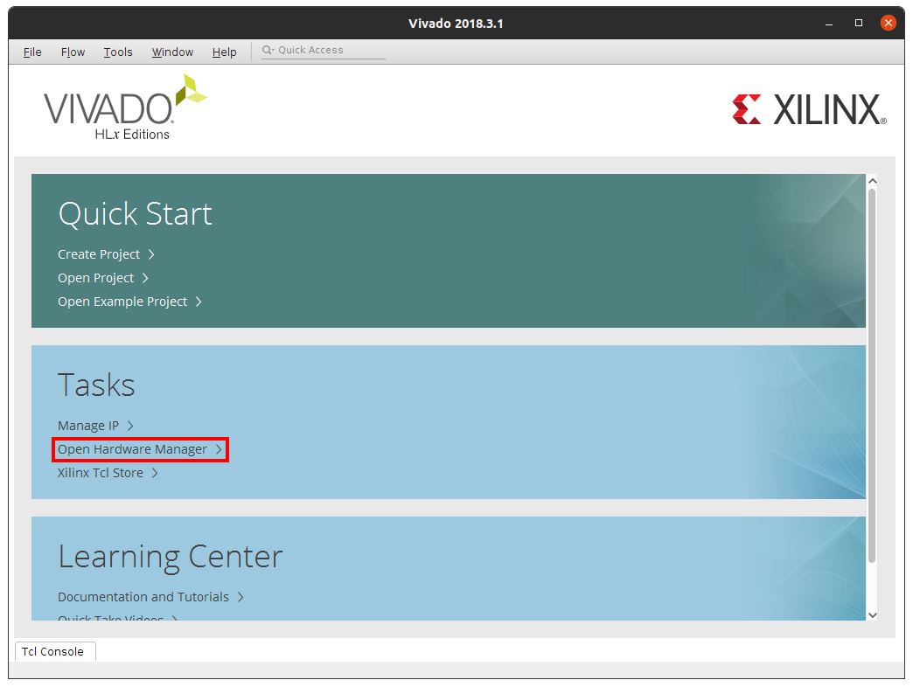
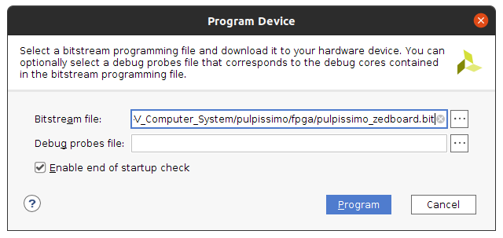

# RISC-V Computer System 

이 저장소는 고려대학교의 [ESCA lab](https://esca.korea.ac.kr)에서의 학부연구생으로서 연구한 내용을 저장하기 위한 저장소입니다.

이 저장소에 pulpissimo를 이용하면서 필요했던 저장소들을 submodule로 추가해두었습니다.

``` shell
$ git clone --recursive https://github.com/hanchaa/RISC-V_Computer_System.git
```
명령어를 통해 submodule까지 모두 다운 받을 수 있습니다.

# 실행 환경
- Ubuntu 16.04LTS
- Python 2.7.12
- Python 3.9.1
- Vivado 2018.3
- Modelsim 10.6c

# PULP RISC-V Toolchain 설치하기
RISC-V용 프로그램을 빌드하기 위해서 RISC-V cross-compiler를 설치해주어야 한다.

Toolchain은 submodule로 추가를 해두었으므로 pulp-riscv-gnu-toolchain 디렉토리로 이동하여 설치를 진행하면 된다.

혹시 해당 폴더가 비어있다면, 다음 명령어를 이용해 submodule을 initialize 하도록 한다.

``` shell
$ git submodule update --init --recursive
```

설치를 진행하기 전, 아래 명령어를 이용해 dependency 부터 우선 설치하도록 한다.

``` shell
$ sudo apt-get install autoconf automake autotools-dev curl libmpc-dev libmpfr-dev libgmp-dev gawk build-essential bison flex texinfo gperf libtool patchutils bc zlib1g-dev
```

dependency 설치가 끝났으면 설치 폴더와 어떤 variation을 지원할지 설정 후 빌드 하면 된다.

``` shell
./configure --prefix=/opt/riscv --with-arch=rv32imc --with-cmodel=medlow --enable-multilib
sudo make
```

--prefix의 옵션으로 설치 폴더를 지정하면 되며 필자는 /opt/riscv에 설치하였다.

또한 --with-arch 옵션을 이용해 어떤 variation을 지원할지 고르면 된다.

# PULP SDK 설치하기
PULP SDK 파일들은 submodule로 추가 해두었으므로 pulp-sdk 디렉토리로 이동하여 설치를 진행하면 된다.

현재 PULP SDK가 업데이트가 이루어지면서 아직 최신버전의 PULP SDK는 pulpissimo를 지원하지 않는다.

따라서 다음 명령어를 이용해 구 버전인 v1 branch에 있는 파일들을 사용해야 한다.

``` shell
$ git checkout v1
```

이후 sdk를 빌드 하기 전에 depedency부터 설치하여야 한다.

만약 ubuntu 16.04 LTS의 기본 python3의 버전인 3.5.2를 사용한다면 numpy 설치가 불가능하므로, 다른 버전의 python3을 설치한 후 update-alternatives를 이용해 python3 명령어의 버전을 최신으로 바꾼 후 아래 과정을 진행하면 된다.

아래 과정들을 진행 후 terminal을 끄기 전에 update-alternatives를 이용해 python3 명령어를 원래의 버전인 3.5.2로 변경하여야 system에 문제가 생기지 않으므로 주의하도록 해야한다. 

``` shell
$ sudo apt install git python3-pip python-pip gawk texinfo libgmp-dev libmpfr-dev libmpc-dev swig3.0 libjpeg-dev lsb-core doxygen python-sphinx sox graphicsmagick-libmagick-dev-compat libsdl2-dev libswitch-perl libftdi1-dev cmake scons libsndfile1-dev
$ sudo pip3 install artifactory twisted prettytable sqlalchemy pyelftools 'openpyxl==2.6.4' xlsxwriter pyyaml numpy configparser pyvcd
$ sudo pip2 install configparser
```

다음으로 toolchain 경로와 vsim 경로를 설정해준다.

``` shell
$ export PULP_RISCV_GCC_TOOLCHAIN=/opt/riscv
$ export VSIM_PATH={pulpissimo_root_path}/sim
```

다음으로 sdk의 target과 platform을 선택한다.

``` shell
$ source configs/pulpissimo.sh
$ source configs/fpgas/pulpissimo/genesys2.sh
```

이 연구에선 ZCU102 보드를 사용했지만 fpga platform은 genesys2.sh만 존재하며 이를 실행시켜도 문제 없이 가능하다.

모든 설정이 끝났으면 아래 명령어를 이용해 sdk를 빌드 할 수 있다.

``` shell
$ make all
```

만약 build 중 ```No module named 'configparser'``` 에러가 발생하는 경우 아래 명령어를 이용해 configparser를 설치 후 다시 빌드를 하면 해결된다.

``` shell
$ sudo apt-get install python-configparser
```

# ZCU102에 Pulpissimo 포팅하기

현재 저장소에 저장되어 있는 pulpissimo는 standalone으로 동작할 수 있게

```
pulpissimo/fpga/pulpissimo-zcu102/tcl/run.tcl
pulpissimo/fpga/pulpissimo-zcu102/rtl/fpga_bootrom.sv
pulpissimo/fpga/pulpissimo-zcu102/rtl/fpga_private_ram.sv
pulpissimo/fpga/pulpissimo-zcu102/rtl/fpga_interleaved_ram.sv
pulpissimo/ips/pulp_soc/rtl/pulp_soc/l2_ram_multi_bank.sv
```
다음의 파일들이 수정되어 있으며,

```
pulpissimo/fpga/pulpissimo-zcu102/ips/xilinx_interleaved_ram_1/ip
pulpissimo/fpga/pulpissimo-zcu102/ips/xilinx_interleaved_ram_2/ip
pulpissimo/fpga/pulpissimo-zcu102/ips/xilinx_interleaved_ram_3/ip
pulpissimo/fpga/pulpissimo-zcu102/ipx/xilinx_private_ram_1/ip
```
다음의 폴더들에 xilinx ip catalog를 통해 만든 block memory ip 들을 만들어 두었다.

이를 이용하면 coe 파일을 이용해 각각의 메모리를 다른 내용으로 초기화 할 수 있다.

또한 불필요한 io들을 제거하기 위해 다음의 파일들도 수정되어 있다.

```
pulpissimo/fpga/pulpissimo-zcu102/constraints/zcu102.xdc
pulpissimo/fpga/pulpissimo-zcu102/rtl/xilinx_pulpissimo.v
pulpissimo/rtl/pulpissimo/pad_control.sv
pulpissimo/rtl/pulpissimo/pad_frame.sv
pulpissimo/rtl/pulpissimo/pulpissimo.sv
pulpissimo/rtl/pulpissimo/safe_domain.sv
```

pulpissimo를 새롭게 시작하려면 [이 저장소](https://github.com/pulp-platform/pulpissimo) 를 새롭게 clone 한 후 아래의 명령어를 실행하면 된다.

``` shell
$ cd <new_pulpissimo_directory>
$ ./update-ips
```

이후 fpga 디렉토리로 이동해 zcu102를 위한 bitstream을 생성하기 위해 아래 명령어를 사용하면 된다.

(이때 vivado: command not found 에러가 발생한다면 vivado 설치 폴더의 settings64.sh 파일을 실행시켰는지 확인한다.)

``` shell
$ cd fpga
$ make zcu-102
```

bitstream 생성이 끝나면 fpga 폴더 안에 pulpissimo_zcu102.bit 파일이 생성된다.

이 파일을 vivado를 실행시킨 후 Hardware Manager > Open Target > Program device 순으로 실행시켜 Zedboard에 flashing을 하면 된다.






# Pulpissimo 용 애플리케이션 빌드하기

pulp-rt-example 폴더로 이동하면 pulpissimo에서 실행 가능한 예제 애플리케이션들이 있다.

여러 애플리케이션들 중 하나를 골라 소스 코드가 있는 폴더로 이동하여 main 함수 선언 전 다음 전역 변수를 추가해준다.

```c
int __rt_fpga_fc_frequency = 20000000;
int __rt_fpga_periph_frequency = 10000000;
```

또한 기본 UART baudrate는 115200으로, 이를 변경하고 싶다면 다음 전역 변수를 추가해주면 된다.

```c
unsigned int __rt_iodev_uart_baudrate = your baudrate;
```

애플리케이션 빌드를 위해서는 PULP SDK와 toolchain 경로가 설정되어 있어야 하며 다음 명령어를 통해 가능하다.

```shell
$ source pkg/sdk/dev/sourceme.sh
$ export PULP_RISCV_GCC_TOOLCHAIN=/opt/riscv 
```

모든 준비가 되었다면 다음 명령어를 통해 애플리케이션 빌드가 가능하다.

```shell
$ make clean all
```

빌드가 성공적으로 끝나면 `build/pulpissimo/[app_name]/[app_name]` 폴더에 ELF 바이너리 파일이 존재한다.

혹시 빌드 중 python 오류가 발생한다면 `update-alternatives`를 이용해 python3의 버전을 바꾼 후 실행하면 된다.

# ZCU102 보드에서 애플리케이션 디버깅하기

pulpissimo 용 애플리케이션을 ZCU102 보드에서 디버깅하기 위해서는 OpenOCD와 JTAG을 연결하는 디바이스가 필요하다.

이 연구에서는 [Digilent JTGA-HS2 Programming Cable](https://store.digilentinc.com/jtag-hs2-programming-cable/) 을 사용하였으며 다음과 같이 연결하면 된다.

| JTAG Signal | FPGA Port | J55 Pin  |
|-------------|-----------|----------|
| tms         | PMOD0_0   | Pin 1    |
| tdi         | PMOD0_1   | Pin 3    |
| tdo         | PMOD0_2   | Pin 5    |
| tck         | PMOD0_3   | Pin 7    |
| gnd         | GND       | Pin 9    |
| vdd         | 3V3       | Pin 11   |

OpenOCD의 경우 pulp-platform에서 제공을 해주고 있으며 우선 다음의 dependency들이 필요하다

- `autoconfg` >= 2.64
- `automake` >= 1.14
- `texinfo`
- `make`
- `libtool`
- `pkg-config` >= 0.23
- `libusb-1.0`
- `libftdi`
- `libusb-0.1` or `libusb-compat-0.1`

위 dependency들을 설치했다면 pulp-sdk 폴더로 이동해 아래의 명령어를 이용해 OpenOCD를 설치 가능하다.

```shell
$ cd pulp-sdk
$ source sourceme.sh
$ ./pulp-tools/bin/plpbuild checkout build --p openocd --stdout
```

설치가 끝났다면 다음 명령어를 실행해 OpenOCD의 주소를 환경 변수 `OPENOCD`에 지정할 수 있다.

```shell
$ source pkg/openocd/sourceme.sh
```

이후 다음 명령어를 실행하고 다음과 같은 화면이 나오면 JTAG을 이용해 ZCU102 보드에 포팅 된 pulpissimo를 디버깅 할 수 있다.
```shell
$ $OPENOCD/bin/openocd -f pulpissimo/fpga/pulpissimo-zcu102/openocd-zcu102-digilent-jtag-hs2.cfg
```


혹시 port busy 에러가 발생한다면 PS 로직에 연결되어 있는 JTAG 연결 케이블을 분리하여야 한다.

OpenOCD를 이용하여 zcu102와 JTAG을 이용해 연결이 되었다면 방금 컴파일한 애플리케이션을 GDB를 이용해 디버깅이 가능하다.

```shell
$ $PULP_RISCV_GCC_TOOLCHAIN/bin/riscv32-unknown-elf-gdb PATH_TO_ELF_FILE
(gdb) target remote localhost:3333
(gdb) load
```


이후 gdb와 동일하게 애플리케이션을 디버깅 할 수 있으며 stdio는 minicom과 같은 uart 통신 프로그램을 이용해 확인할 수 있다.


